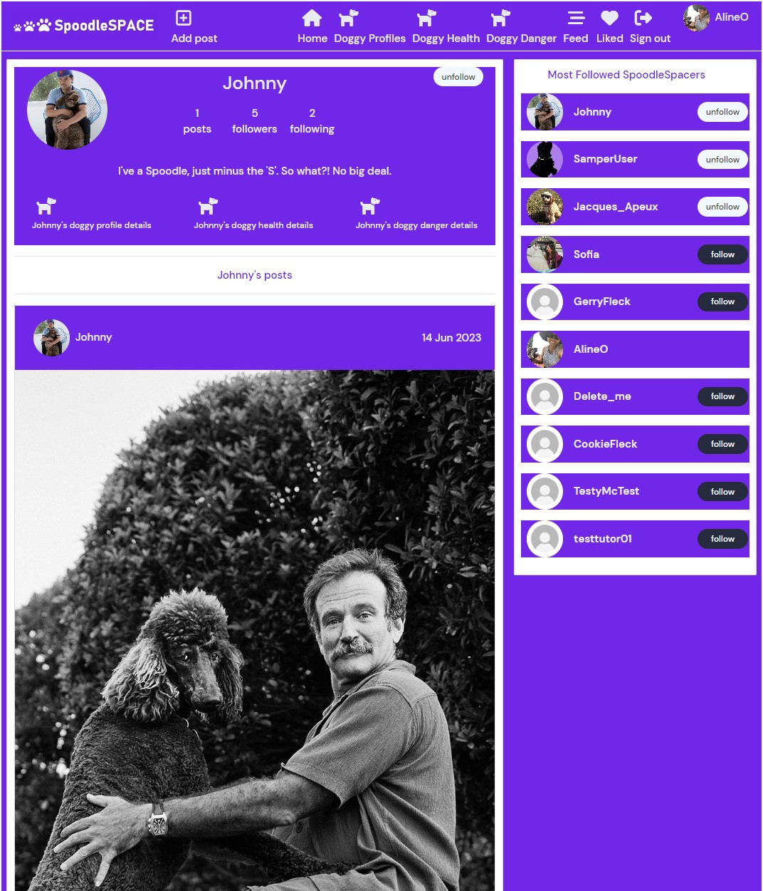
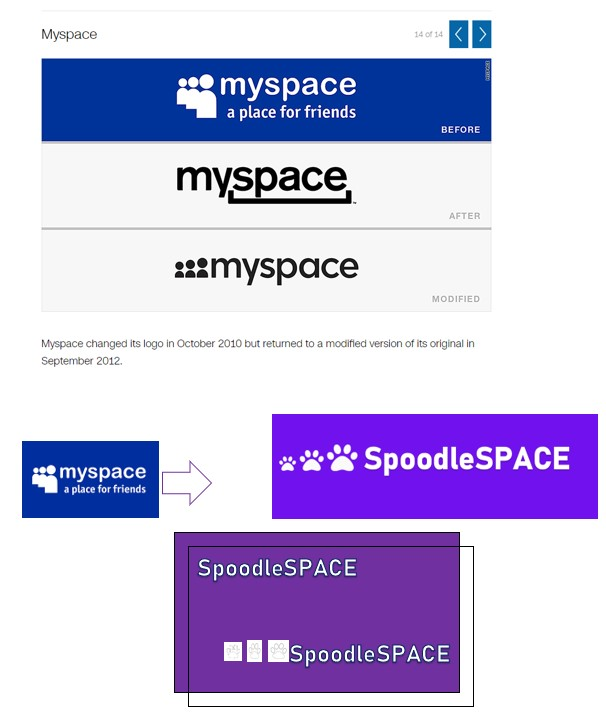

# **SpoodleSpace**

**[SpoodleSpace](https://spoodle-space-pp5.herokuapp.com/)** was developed and submmitted as my fifth Profile Portfolio Project as part of the Advanced Frontend specialization for Code Institute's Diploma in full-stack software development. 

# 

This project introduces a new range of features and funcionalities that offer Users a valuable expansion on my fourth Profile Portfolio Project, **[Cockapoo Club](https://home-cockapoo-club-pp4.herokuapp.com)**, a website used by a fictional online community of dog owners, specifically owners of a breed called 'Cockapoos' (a Cocker Spaniel-Poodle cross) sometimes reffered to as 'Spoodles' (combining the words 'Spaniel' and Poodle').   

Since inital iterations based on this original concept, on offer here is a different set of features and functionalities which have evolved into a significantly more immersive, interactive and fuller experience for users. The added value of this project is rooted in offering users the only social media platform of its kind, as far as I am aware, that is tailored secifically for  all Cockapoo owners around the world. 

This platform is intended to not only meet the demand for learning and interacting in a fun way from others who share the expereince of having Cockapoos in their lives, but also to increase that demand. This platform provides a rare opportunity to establish and develop their own very unique online community.     

- View the deployed website **[Here](https://spoodle-space-pp5.herokuapp.com)** 

- View the repository on Github **[Here](https://github.com/SamOBrienOlinger/spoodle-space-pp5)**.

- View the backend repository on Github **[Here](https://github.com/SamOBrienOlinger/drf-spoodle-space)**. 

## Contents

 - **[User Stories](#user-stories)**

 - **[Agile Development Process](#agile-development-process)**

- **[Typography](#typography)**

- **[Main Features](#main-features)**

- **[Features for the future](#features-for-the-future)**

- **[Testing](#testing)**

- **[Deployment](#deployment)**

- **[Technologies used](#technologies-used)**

 - **[Credits](#credits)**

   ## [**User Stories**](#user-stories)

   **Navigation and authentication**

    - Navigation: As a user I can view a navbar from every page so that I can navigate easily between pages

    - Routing: As a user I can navigate through pages quickly so that I can view content seamlessly without page refresh

    - Authentication - Sign up: As a user I can create a new account so that I can access all the features for signed up users

    - Authentication - Sign in: As a user I can sign in to the app so that I can access functionality for logged in users

    - Authentication - Logged in Status: As a user I can tell if I am logged in or not so that I can log in if I need to

    - Authentication - Refreshing access tokens: As a user I can maintain my logged-in status until I choose to log out so that my user experience is not compromised

    - Navigation: Conditional rendering - As a logged out user I can see sign in and sign up options so that I can sign in/sign up

    - Avatar: As a user I can view user's avatars so that I can easily identify users of the application

    **Profile**

    - Profile page: As a user I can view other users profiles so that I can see their posts and learn more about them
    - Most followed profiles: As a user I can see a list of the most followed profiles so that I can see which profiles are popular
    - As a user I can view data about other users, such as the number of posts, follows and users followed so that I can learn more about them.
    - Follow/Unfollow a user: As a logged in user I can follow and unfollow other users so that I can see and remove posts by specific users in my posts feed
    - View all posts by a specific user: As a user I can view all the posts by a specific user so that I can catch up on their latest posts, or decide I want to follow them
    - Update username and password: As a logged in user I can update my username and password so that I can change my display name and keep my profile secure

    Posting, liking and commenting on images
    
    -  Create posts: As a logged in user I can create posts with images. 
    -  View a post: As a user I can view the details of a single post so that I can learn more about it
    -  Like a post: As a logged in user I can like a post so that I can show my support for the posts that interest me.
    -  Post page: As a user I can view the posts page so that I can read the comments about the post
    -  Edit post: As a post owner I can edit my post title and description so that I can make corrections or update my post after it was created
    -  Create a comment: As a logged in user I can add comments to a post so that I can share my thoughts about the post
    -  Comment date: As a user I can see how long ago a comment was made so that I know how old a comment is
    -  View comments: As a user I can read comments on posts so that I can read what other users think about the posts
    -  Delete comments: As an owner of a comment I can delete my comment so that I can control removal of my comment from the application
    -  Edit a comment: As an owner of a comment I can edit my comment so that I can fix or update my existing comment

    **Dog profile**

    -  As a logged in user I can create and edit my dog profile, including being able to add and change a picture of my dog and information about my dog. 

    -  As a logged in user I can view other user's dog profiles if I am following them.
    -  As a user I can view the most recent dog profiles posted, ordered by most recently created first so that I am up to date with the newest content.
    -  As a user, I can search for dog profiles with keywords, so that I can find the dog profiles and user profiles I am most interested in.
    -  Infinite scroll: As a user I can keep scrolling through the images on the site, that are loaded for me automatically so that I don't have to click on "next page".

        
   **Dog health details**

    -  As a logged in user I can create and edit health details about my dog.  

    -  As a logged in user I can view the health details of other user's dogs if I am following them.
    -  As a user I can view the most recent details about the health of users' dogs, ordered by most recently created first so that I am up to date with the newest content.
    -  As a user, I can search for dog health details with keywords, so that I can find the dog health details and user profiles I am most interested in.
    -  Infinite scroll: As a user I can keep scrolling through the images on the site, that are loaded for me automatically so that I don't have to click on "next page".

    
    **Dog danger details**

    -  As a logged in user I can create and edit details about how dangerous my dog is.  

    -  As a logged in user I can view the details of how dangerous other user's dogs are if I am following them.

    -  As a user I can view the most recent details posted about how dangerous other users' dogs are, ordered by most recently created first so that I am up to date with the newest content.
    -  As a user, I can search for these details with keywords, so that I can find the details and user profiles I am most interested in.
    -  Infinite scroll: As a user I can keep scrolling through the images on the site, that are loaded for me automatically so that I don't have to click on "next page".

    **UX Design**

      Each stage of the UX design process involved revisiting the purpose of the product and reflecting on the goals of every User Story. 

    - Early Stage Mock-Ups 

      

      

      

        As the above image of ideas for logos demonstrates, SpoodleSpace is self-aware of it's simple and 'old fashioned' feel, but from the early stages of development, providing a more 'basic' UX was cosnidered a positive attribute.

        At the very beginning, there was almost no consideration given to developing a product that combined the themes of post-nostalgia and post-retro that might result in a UX designed to be “so bad, it’s good”. 
        
        A significant amount of the added value this platform offers Users is rooted in how it references older versions of current and obsolete platforms. 
        
        In later stages of development it became clearer that the platform could also be interpreted as a parody of contemporary social platforms combining UI and UX for positive effect.

    - Front-end Library
      
        -  React Bootstrap was chosen as much out of neccesity due to tight timeframe for delivering a MVP, as it was for providing components built from scratch with no unneeded dependencies and is accessible by default.

### [**Agile Development Process**](#agile-development-process)

  - Github Projects was used to structure the workflow. 
  - View the Project on Github [**Here**](https://github.com/users/SamOBrienOlinger/projects/3)
    
To achieve the site goals outlined in the User Stories section above, the development process was divided into sprints with three categories using the MoSCoW method. This helped prioritize the implementation of features based on their importance.

- **Must Have**

  - User Authentication: Users can create an account, sign in, and sign out.
  - User Profiles: CRUD functionality for users to personalize their presence on the website through profile pages.
  - Followers Feed: Users can view a list of posts by other users they are following. The logic for this feature can be found in the `utils.js`, `ProfileDataContext.js`, and `ProfilePage.js` files.
  - Liked Feed: Users can view a feed of posts they have liked. This feature is implemented in the `Navbar.js` component.
  - Image Posts: Users can create, read, update, and delete posts with images, titles, and descriptions.
  - Custom Models and Forms: Three custom models and corresponding forms with CRUD functionalities that are relevant to the site goal.

- **Should Have**

  - Infinite Scroll: Implementing infinite scroll functionality for an improved user experience.
  - Search Bar: Users can search for posts and navigate to pages related to the three custom models and forms.

- **Could Have**

   - Online Resources: A feature that provides users with access to relevant websites and a list of online resources related to the site goal.
   - Portfolio Project Link: A feature that redirects users to my Portfolio Project 4, [Cockapoo Club, Dublin Ireland](https://home-cockapoo-club-pp4.herokuapp.com).

### [**Typography**](#typography)

- The main font used throughout the project was Lato. 

- These fonts were chosen to remain consistent with previous projects for [**Features for the future**](#features-for-the-future) when they are connected to each other. 

### [**Main Features**](#main-features)

 - Each of the features and goals for every User Stories outlined in detail above were implemented.

 - The React architecture provided reusable components that I customized, such as the Navbar. The MoreDropDown component was also adapted and applied to each custom model & form.

### [**Features for the future**](#features-for-the-future)

  Features planned for future implementation are:

  - Connecting **[SpoodleSpace](https://home-cockapoo-club-pp4.herokuapp.com)** with **[Cockapoo Club](https://home-cockapoo-club-pp4.herokuapp.com)** to widen the scope of both products and increase sustained engagement for both.    

  - Functionality for liking and commenting on user's **dog profile**, **dog health details** and their **dog danger details**. 

  - A customised drop down menu component for appropriate fields for some of the models and forms that implements Yes/No options when creating and editing user's **dog profile**, **dog health details** and their **dog danger details**.  

### [**Testing**](#testing)

- **Manual Testing**

    - Manual testing of every feature was conducted on an ongoing basis throughout development. All manual testing passed, once bugs were fixed. 
    All forms, searchbars, links, buttons functioned as intended; uploading images and so on were all tested and passed.
    
- **Validator Testing**

    - **Python**

         [CI Python Linter](https://pep8ci.herokuapp.com/) was the validator used. All the Python code passed without errors, except for the following files `home/urls.py`, `settings.py`, `book_sessions/views.py`, `book_sessions/urls.py` which gave E501 'line too long' warnings.

     - **JavaScript**

         [JSHint](https://jshint.com/) was used to validate the JavaScript in this project.

     - **CSS**

          [W3C CSS Validator](https://jigsaw.w3.org/css-validator/#validate_by_input) was used to validate all CSS code. All CSS passed with one warning regarding Imported style sheets.

    - **HTML**

      All HTML code was validated using [Nu Html Checker](https://validator.w3.org/nu/), except for

### [**Deployment**](#deployment)

Heroku was used to deploy this project by the following these steps:

1. Create or log in to your account on [Heroku.com](https://www.heroku.com/)
2. Create a a unique app name and choose your region
3. Click on create app
4. Push your changes to GitHub
5. Push the code to Heroku using the command git push heroku main
6. Log in to heroku.com and open the dashboard for your react application (remember this is separate from the DRF application that runs your API)
7. Select the “Deploy” tab in the dashboard
8. Scroll down to the bottom and then select “Deploy Branch”
9. Wait for your build to complete (you can click “view build log” to watch the process in a larger window)
10. When you see the message “deployed to Heroku” in the build log, click the “open app” button at the top of the page.

### [**Technologies used**](#technologies-used)
  
  - **Languages**

    - HTML
    - CSS
    - Javascript

  
  - **Libraries, frameworks and dependencies**

    - [React](https://reactjs.org/)
    - [React Router](https://v5.reactrouter.com/web/guides/philosophy)
    - [React Infinite Scroll](https://www.npmjs.com/package/react-infinite-scroll-component)
    - [Axios](https://axios-http.com/)
    - [React Bootstrap](https://react-bootstrap.github.io/)
    - [Font Awesome](https://fontawesome.com/)
    - [Cloudinary](https://cloudinary.com/)
    - [Prettier](https://prettier.io/)

  
  - **Development tools and programs**

    - [VS Code](https://code.visualstudio.com/)
    - [GitHub](https://github.com/)
    - [ElephantSQL](https://customer.elephantsql.com/)
    - [Heroku](https://dashboard.heroku.com)

### [**Credits**](#credits)

  - [W3Schools](https://www.w3schools.com/) 
  - [Stack Overflow](https://stackoverflow.com/)
  - Code Institute's [Moments](https://github.com/Code-Institute-Solutions/moments) module.

  - The [README template](https://github.com/Code-Institute-Solutions/readme-template) provided by Code Institute was very helpful as a model for developing this README file.

  - Code Institute Alumnist [Tom Ainsworth](https://github.com/Tom-Ainsworth) was of great support at strategically important stages to tease out certain bugs.   

  - My mentors, [Naoise Gaffney](https://github.com/NaoiseGaffney) and [Antonio Rodriguez](AntonioRodriguez_mentor), provided invaluable support and I learned a lot from them throughout the development of this project. 
  
  Last but certainly not least, are the Code Institute's [Student Care Team](https://learn.codeinstitute.net/ci_support/diplomainsoftwaredevelopmentadvancedfrontend/studentcare) and all the Tutors on the [Student Support Team](https://learn.codeinstitute.net/ci_support/specializationsamplecontent/troubleshooting). Regardless of the challenge faced, they have provided invaluable support to me in developing my skills, knowledge and expereince. Thank you very much. 

