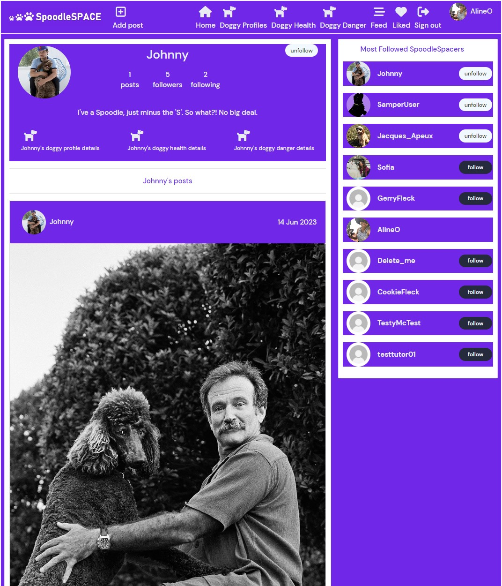
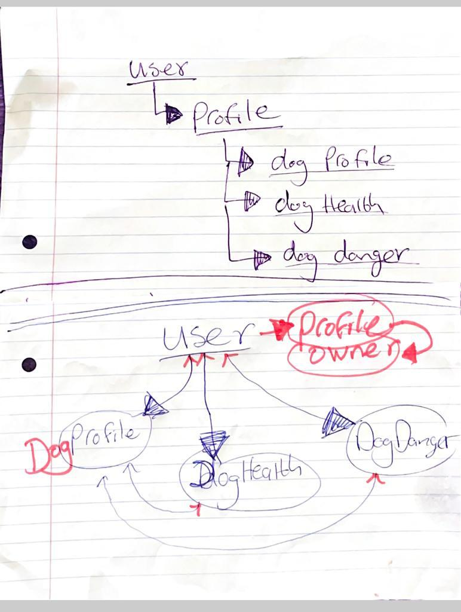
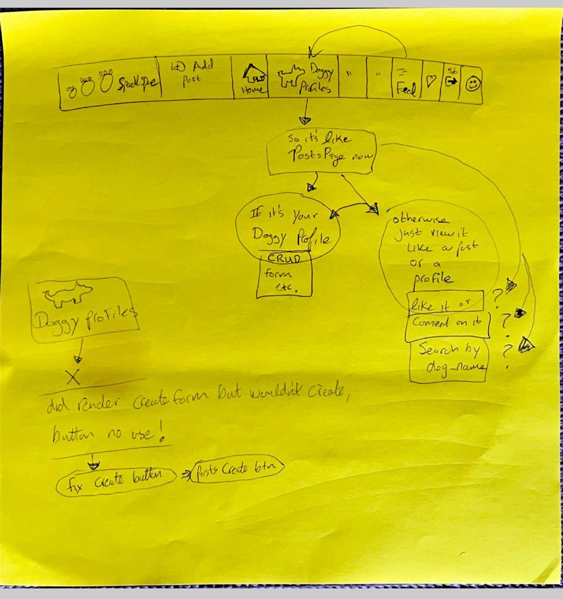
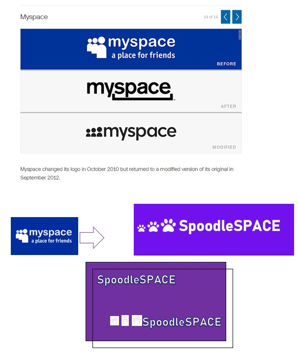
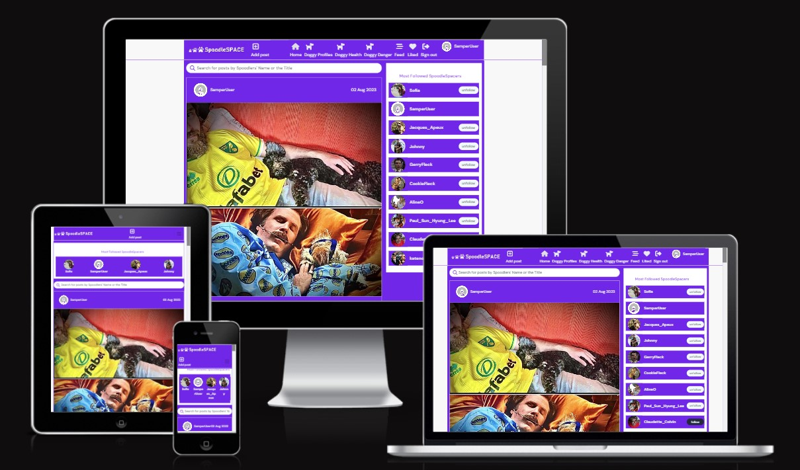

# **SpoodleSpace - Frontend**


**[SpoodleSpace](https://spoodle-space-pp5.herokuapp.com/)** was developed and submitted as my fifth Profile Portfolio Project as part of the Advanced Frontend specialization for Code Institute's Diploma in full-stack software development. 

# 

This project introduces a new range of features and functionalities that offer Users a valuable expansion on my fourth Profile Portfolio Project, **[Cockapoo Club](https://home-cockapoo-club-pp4.herokuapp.com)**, a website used by a fictional online community of dog owners, specifically owners of a breed called 'Cockapoos' (a Cocker Spaniel-Poodle cross) sometimes referred to as 'Spoodles' (combining the words 'Spaniel' and Poodle').   

Since initial iterations based on this original concept, on offer here is a different set of features and functionalities which have evolved into a significantly more immersive, interactive and fuller experience for users. The added value of this project is rooted in offering users the only social media platform of its kind, as far as I am aware, that is tailored specifically for  all Cockapoo owners around the world. 

This platform is intended to not only meet the demand for learning and interacting in a fun way from others who share the experience of having Cockapoos in their lives, but also to increase that demand. This platform provides a rare opportunity to establish and develop their own very unique online community.     

- View the deployed website **[Here](https://spoodle-space-pp5.herokuapp.com)**

- View the backend repository on Github **[Here](https://github.com/SamOBrienOlinger/drf-spoodle-space)**. 

---
> 🚧 **Site is Available on Desktop, but Temporarily Unavailable on Mobile Devices. This is due a necessary Database Migration as a result of ElephantSQL's End of Life. The website has since been moved to Heroku's PostgreSQL database service**  

> I am actively working to restore full functionality for use on mobile devices as quickly as possible. I am also evaluating a wide range of other relational database management systems to ensure the website has a robust and scalable infrastructure for the future.

> **Thank you for your patience. I appreciate your understanding.**
>
---

## Contents

 - **[User Stories](#user-stories)**
   
 - **[UX and UI Design](#ux-and-ui-design)**

 - **[Agile Development Process](#agile-development-process)**

- **[Typography](#typography)**

- **[Main Features](#main-features)**

- **[Features for the future](#features-for-the-future)**

- **[Testing](#testing)**

- **[Deployment](#deployment)**

- **[Technologies used](#technologies-used)**

 - **[Credits](#credits)**

   ## [**User Stories**](#user-stories)

   **Navigation and authentication**

    - Navigation: As a user I can view a navbar from every page so that I can navigate easily between pages

    - Routing: As a user I can navigate through pages quickly so that I can view content seamlessly without page refresh

    - Authentication - Sign up: As a user I can create a new account so that I can access all the features for signed up users

    - Authentication - Sign in: As a user I can sign in to the app so that I can access functionality for logged in users

    - Authentication - Logged in Status: As a user I can tell if I am logged in or not so that I can log in if I need to

    - Authentication - Refreshing access tokens: As a user I can maintain my logged-in status until I choose to log out so that my user experience is not compromised

    - Navigation: Conditional rendering - As a logged-out user I can see sign in and sign-up options so that I can sign in/sign up

    - Avatar: As a user I can view user's avatars so that I can easily identify users of the application

    **Profile**

    - Profile page: As a user I can view other users’ profiles so that I can see their posts and learn more about them
    - Most followed profiles: As a user I can see a list of the most followed profiles so that I can see which profiles are popular
    - As a user I can view data about other users, such as the number of posts, follows and users followed so that I can learn more about them.
    - Follow/Unfollow a user: As a logged in user, I can follow and unfollow other users so that I can see and remove posts by specific users in my posts feed
    - View all posts by a specific user: As a user I can view all the posts by a specific user so that I can catch up on their latest posts, or decide I want to follow them
    - Update username and password: As a logged in user, I can update my username and password so that I can change my display name and keep my profile secure

    Posting, liking and commenting on images
    
    -  Create posts: As a logged in user, I can create posts with images. 
    -  View a post: As a user I can view the details of a single post so that I can learn more about it
    -  Like a post: As a logged in user, I can like a post so that I can show my support for the posts that interest me.
    -  Post page: As a user I can view the posts page so that I can read the comments about the post
    -  Edit post: As a post owner I can edit my post title and description so that I can make corrections or update my post after it was created
    -  Create a comment: As a logged in user, I can add comments to a post so that I can share my thoughts about the post
    -  Comment date: As a user I can see how long ago a comment was made so that I know how old a comment is
    -  View comments: As a user I can read comments on posts so that I can read what other users think about the posts
    -  Delete comments: As an owner of a comment, I can delete my comment so that I can control removal of my comment from the application
    -  Edit a comment: As an owner of a comment, I can edit my comment so that I can fix or update my existing comment

    **Dog profile**

    -  As a logged in user I can create and edit my dog profile, including being able to add and change a picture of my dog and information about my dog. 

    -  As a logged in user I can view other user's dog profiles if I am following them.
    -  As a user I can view the most recent dog profiles posted, ordered by most recently created first so that I am up to date with the newest content.
    -  As a user, I can search for dog profiles with keywords, so that I can find the dog profiles and user profiles I am most interested in.
    -  Infinite scroll: As a user I can keep scrolling through the images on the site, that are loaded for me automatically so that I don't have to click on "next page".

        
   **Dog health details**

    -  As a logged in user I can create and edit health details about my dog.  

    -  As a logged in user I can view the health details of other user's dogs if I am following them.
    -  As a user I can view the most recent details about the health of users' dogs, ordered by most recently created first so that I am up to date with the newest content.
    -  As a user, I can search for dog health details with keywords, so that I can find the dog health details and user profiles I am most interested in.
    -  Infinite scroll: As a user I can keep scrolling through the images on the site, that are loaded for me automatically so that I don't have to click on "next page".

    
    **Dog danger details**

    -  As a logged in user I can create and edit details about how dangerous my dog is.  

    -  As a logged in user I can view the details of how dangerous other user's dogs are if I am following them.

    -  As a user I can view the most recent details posted about how dangerous other users' dogs are, ordered by most recently created first so that I am up to date with the newest content.
    -  As a user, I can search for these details with keywords, so that I can find the details and user profiles I am most interested in.
    -  Infinite scroll: As a user I can keep scrolling through the images on the site, that are loaded for me automatically so that I don't have to click on "next page".
 
  ## **[UX and UI Design](#ux-and-ui-design)**

   ### **UX Design**

   Each stage of the UX design process involved revisiting the purpose of the product and reflecting on the goals of every User Story. 

   - Early-Stage Mock-Ups 

     

     

     

        As the above image of ideas for logos demonstrates, SpoodleSpace is self-aware of it's simple and 'old fashioned' feel, but from the early stages of development, providing a more 'basic' UX was considered a positive attribute. At the very beginning, there was almost no consideration given to developing a product that combined the themes of post-nostalgia and post-retro that might result in a UX designed to be “so bad, it’s good”. 
        
        A significant amount of the added value this platform offers Users is rooted in how it references older versions of current and obsolete platforms. 
        
        In later stages of development, it became clearer that the platform could also be interpreted as a parody of contemporary social platforms combining UI and UX for positive effect.

  ### **UI Design**
   
   Given the nature of the project being a social platform, it was paramount that the aesthetic served a range purposes. The main priorities were:

   - **Branding and Consistency**: maintaining a consistent color scheme across the app is intended to make the app easily recognizable and memorable.

   - **Readability and Accessibility**: the decision to use a strong background color to contrast with text aimed to ensure that content is easy to read and accessible to all users, including those with visual impairments.

   - **Feedback and Interactivity**: the standard expectations of today's users around UI had to be considered. This project attempts to use these taken-for-granted expectations to maximise the impact of basic features on the user, such as changing the color of a button when it's hovered over or clicked.
Often, websites opt for more subtle and subdued shifts between colors to notify users of any data changes happening and to provide real-time feedback to users. SpoodleSapce uses both subtle color themes familiar to users and then loud unexpected strong contrasting colors to achieve a more intense and enhanced UI depending on the context. 

   - **Consistency Across Components**: the styling defined in each of the separate CSS modules reuses a color scheme that can be efficiently applied to the different components as needed, ensuring a consistent look and feel.

   **Color Scheme**

   There are a total of 13 different colors used throughout the project: 

  - `#f8f8f8`
  - `#e9ebf2`
  - `#7112ee`
  - `#ffffff`
  - `#dadadf`
  - `#7177a1`
  - `#7112FB2`
  - `#242a3d`
  - `#3b3d24`
  - `#cfced3`
  - `#7112ee`
  - `#7112FB2`
  - `#242a3d`


These colors are used for background colors, text colors, and border colors.

  

   Following on from the points made about the importance of UI for this project, the most frequently used colors are:

   - **Background Colors:**
     - `#f8f8f8`
     - `#ffffff`
     - `#f1f1f1`

   - **Text Colors:**
     - `#e9ebf2`
     - `#7112ee`
     - `#7177a1` 

 There are three features most directly connected to the core concept of the website and to the three custom models in the backend. The styling for each can be found in these files: 

 - DogProfile.module.css
 - DogHealth.module.css
 - DogDanger.module.css 

For UX and UI reasons outlined above, it was important that they shared the same color scheme and overall styling. 
The shared Styles for DogProfile, DogHealth, and DogDanger modules are:

- Background Color: `#ffffff`
- Border Color: `#dadadf`
- Border Radius: `2px`
- Margin Bottom: `16px`
- Text Alignment: `center`

To provide real-time feedback to Users notifying them of any changes they make to their data I used React's ['Notification Container' component](https://www.npmjs.com/package/react-notifications).

The front-end library chosen for the project was [React Bootstrap](https://github.com/react-bootstrap/react-bootstrap) to combine the component-based approach of React with the styling and design principles of Bootstrap. The advantage of this decision was directly linked to the tight timeframe for delivering a MVP. Its 'out of the box' components and pre-built styles removed a significant amount of the time and energy required. Other advantages of its key features for this project include:

- React Components: It provides React-compatible versions of Bootstrap components, allowing developers to use them in their React applications seamlessly.

- Responsive Design: React Bootstrap components are designed to be responsive, adapting to different screen sizes and devices.

- Customization: While React Bootstrap provides ready-to-use components, developers can still customize and extend these components to meet the specific requirements of their applications.

- Integration: React Bootstrap can be easily integrated into existing React projects. Developers can import individual components or the entire library based on their needs.

- Maintained and Updated: React Bootstrap is actively maintained and updated to align with the latest versions of React and Bootstrap.

### [**Agile Development Process**](#agile-development-process)

  - Github Projects was used to structure the workflow. 
  - View the Project on Github [**Here**](https://github.com/users/SamOBrienOlinger/projects/3)
    
To achieve the site goals outlined in the User Stories section above, the development process was divided into sprints with three categories using the MoSCoW method. This helped prioritize the implementation of features based on their importance.

- **Must Have**

  - User Authentication: Users can create an account, sign in, and sign out.
  - User Profiles: CRUD functionality for users to personalize their presence on the website through profile pages.
  - Followers Feed: Users can view a list of posts by other users they are following. The logic for this feature can be found in the `utils.js`, `ProfileDataContext.js`, and `ProfilePage.js` files.
  - Liked Feed: Users can view a feed of posts they have liked. This feature is implemented in the `Navbar.js` component.
  - Image Posts: Users can create, read, update, and delete posts with images, titles, and descriptions.
  - Custom Models and Forms: Three custom models and corresponding forms with CRUD functionalities that are relevant to the site goal.
  - README.md files for the frontend and backend repositories.
  - Testing


- **Should Have**

  - Infinite Scroll: Implementing infinite scroll functionality for an improved user experience.
  - Search Bars: Users can search for posts and navigate to pages related to the three custom models and forms.

- **Could Have**

   - Online Resources: A feature that provides users with access to relevant websites and a list of online resources related to the site goal.
   - Portfolio Project 4 Link: A feature that redirects users to my Portfolio Project 4, [Cockapoo Club, Dublin Ireland](https://home-cockapoo-club-pp4.herokuapp.com).

- **Would Have**

    - Add functionality to upload video to posts.

### [**Typography**](#typography)

- The main font-family used throughout the project was "Lato", "Oswald", "DM Sans", "sans-serif". 

- These fonts were chosen to remain consistent with previous projects for [**Features for the future**](#features-for-the-future) when they are connected to each other. 

### [**Main Features**](#main-features)

 - Each of the features and goals for every User Stories outlined in detail above were implemented.

 - The React library provided menu of reusable components that were vital to allowing me using specific element across multiple features on the frontend on the project. These invaluable components saved me an immeasurable amount of time. I either customized or relied heavily on the following to meet the site goal:

    - Assets.js
    - Avatar.js
    - MoreDropDown.js
    - ProfileEditDropdown.js
    - Navbar.js 
    - NotFound.js


    **Asset.js**

    This component can display an image, a spinner, and/or a message to the user depending on the circumstances. It accepts the following props:

    - `spinner`: A boolean indicating whether to display a spinner animation.
    - `src`: The source URL of an image.
    - `message`: A message to display.

    **Avatar.js**

      This component is used to display the user's personalised avatar with an image they are able to choose. It accepts the following props:

      - `src`: The source URL of the avatar image.
      - `height`: The height of the avatar image.
      - `text`: Text to overlay on the avatar.

    **MoreDropdown.js**

      This component represents a dropdown menu with options for the user to edit and delete details as needed. It uses Bootstrap's Dropdown component and accepts two callback functions:

      - `handleEdit`: A callback function for the edit action.
      - `handleDelete`: A callback function for the delete action.

      **ProfileEditDropdown.js**

      Similar to `MoreDropdown`, this component allows the user to use a dropdown menu with options for editing their profile. It accepts the `id` of the profile to determine where to redirect for editing.

      **NavBar.js**

      This component provides navigation links and icons based on whether a user is logged in or not. It includes features such as sign out and dynamic icons based on a user's authentication status.

      **NotFound.js**

      This component is used to display a "Not Found" message along with an image when a user tries to access a non-existent page. It uses the `Asset` component to display the image and message.


### [**Features for the future**](#features-for-the-future)

  Features planned for future implementation are:

  - Connecting **[SpoodleSpace](https://home-cockapoo-club-pp4.herokuapp.com)** with **[Cockapoo Club](https://home-cockapoo-club-pp4.herokuapp.com)** to widen the scope of both products and increase sustained engagement for both.    

  - Functionality for liking and commenting on user's **dog profile**, **dog health details** and their **dog danger details**. 

  - A customised drop down menu component for appropriate fields for some of the models and forms that implements Yes/No options when creating and editing user's **dog profile**, **dog health details** and their **dog danger details**.  

### [**Testing**](#testing)

- **Manual Testing**

    Manual testing of every feature, component and page was conducted on an ongoing basis throughout development. All test cases performed as intended and passed. The most important of these, regarding users being able to Create, Read, Update and Delete data, included:

    - Overlays
    - Tooltips
    - forms 
    - search bars
    - links
    - dropdown menus
    - redirects
    - authentication
    - ownership
    - toggles
    - buttons 
    - uploading images

    A separate file providing details of all the test cases carried out can be found **[here](testing.md)**

  
    The following tools were used to support, test and fix any responsive design issues:

  - [React Bootstrap](https://github.com/react-bootstrap/react-bootstrap) 
  - [Chrome DevTools](https://developer.chrome.com/docs/devtools/)
  - [Am I Responsive:](https://ui.dev/amiresponsive)  



  When testing if the website was responsive or not in order to improve the UI media queries were implemented for the relevant components as follows:

- The DogProfilePage.module.css file uses the same media query as Code Institute's ProfilePage.module.css but uses a more appropriate className. 

  ```css
    @media screen and (max-width: 991px) {
      .DogProfileImage {
        width: 250px;
        height: 250px;
  ```


  ```css
    @media screen and (max-width: 991px) {
      .ProfileImage {
        width: 250px;
        height: 250px;
      }
    }
  ```
  
- Due to the number of icons and features added to the Navigation bar, in the file NavBar.module.css the media query regarding className '.NabBar' was adapted to the following:

  ```css
    @media screen and (max-width: 576px) {
      .NavBar {
      padding-left: 0rem;
      padding-right: 0rem;
  ```


 - [Prettier](https://prettier.io/) and [ESLint](https://eslint.org/) were used to enforce consistent code formatting. 

### [**Deployment**](#deployment)

Heroku was used to deploy this project by the following these steps:

1. Create or log in to your account on [Heroku.com](https://www.heroku.com/)
2. Click "New" and select "Create new app", then add a unique app name and choose your region
3. Click on create app
4. Push your changes to GitHub
5. Push the code to Heroku using the command git push Heroku main
6. Log in to heroku.com and open the dashboard for your React application (this is separate from the Django Rest Framework application that runs the API). In settings, make sure that the 'Config Vars' match the env.py file and that DEBUG and DEVELOPMENT are set correctly. 
7. Before Selecting the “Deploy” tab in the dashboard, add 'Python' to the 'buildpack' if not already present. 
8. Connect to Github, the relevant repository and choose the correct branch before clicking on “Deploy Branch”
9. When you see the message “deployed to Heroku” in the build log, click the “open app” button at the top of the page.

### [**Technologies used**](#technologies-used)
  
  - **Languages**

    - HTML
    - CSS
    - JavaScript

  
  - **Libraries, frameworks and dependencies**

    - [React](https://reactjs.org/) was the core library used for building this website.

    - [React Router](https://v5.reactrouter.com/web/guides/philosophy)  handled the navigation between views and components.

    - [React Infinite Scroll](https://www.npmjs.com/package/react-infinite-scroll-component) was used for to load content as the user scrolls down the page.

    - [Axios](https://axios-http.com/) is used here to make the HTTP requests and handle data fetching.


    - [React Bootstrap](https://react-bootstrap.github.io/) provided the pre-built UI components described above. 


    - [Font Awesome](https://fontawesome.com/) allowed me to use scalable vector icons which add value to the UX.

    - [Cloudinary](https://cloudinary.com/) is the cloud-based image and video management platform used.

  
  - **Development tools and programs**

    - [VS Code](https://code.visualstudio.com/)
    - [Chrome DevTools](https://developer.chrome.com/docs/devtools/)
    - [GitHub](https://github.com/)
    - [ElephantSQL](https://customer.elephantsql.com/)
    - [Heroku](https://dashboard.heroku.com)
  


### [**Credits**](#credits)

  - [W3Schools](https://www.w3schools.com/) 
  - [Stack Overflow](https://stackoverflow.com/)
  - Code Institute's [Moments](https://github.com/Code-Institute-Solutions/moments) module.
  - coolers.co [coolers](https://coolors.co/)

  - The [README template](https://github.com/Code-Institute-Solutions/readme-template) provided by Code Institute was very helpful as a model for developing this README file.

  - Code Institute Alumni [Tom Ainsworth](https://github.com/Tom-Ainsworth) and [Andy Guttridge](https://github.com/andy-guttridge) were of great support at strategically important stages to tease out certain bugs.   

  - My mentors, [Naoise Gaffney](https://github.com/NaoiseGaffney) and [Antonio Rodriguez](AntonioRodriguez_mentor), provided invaluable support and I learned a lot from them throughout the development of this project. 
  
  Last but certainly not least, are the Code Institute's [Student Care Team](https://learn.codeinstitute.net/ci_support/diplomainsoftwaredevelopmentadvancedfrontend/studentcare) and all the Tutors on the [Student Support Team](https://learn.codeinstitute.net/ci_support/specializationsamplecontent/troubleshooting). Regardless of the challenge faced, they have provided invaluable support to me in developing my skills, knowledge and experience. Thank you very much. 
